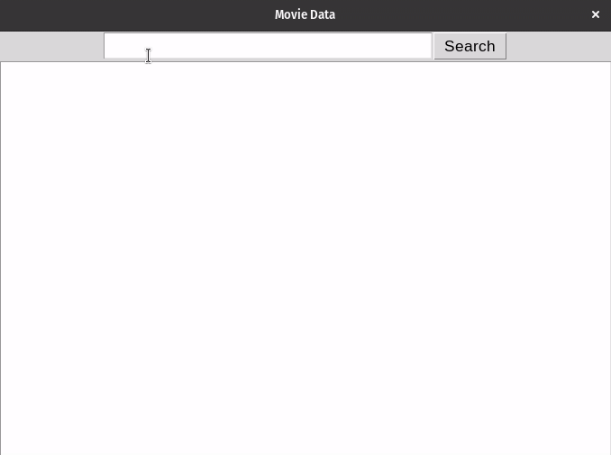

# API with Tkinter

In this project we are going to use Tkinter to
consume an API from OMDb (Open Movie Database)

Just type the name of the movie in English and when you click on 
search it will return some information, for example: title, 
running time, director, among others.

